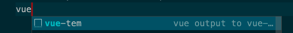

打开vscode，Code --> Preference --> User Snippets，选择你想要配置的代码文件类型

拿Vue举例子，输入Vue，会跳转到Vue.json，在它给你的大括号里可以像我下面示例一样插入：
```
{
	// Place your snippets for vue here. Each snippet is defined under a snippet name and has a prefix, body and 
	// description. The prefix is what is used to trigger the snippet and the body will be expanded and inserted. Possible variables are:
	// $1, $2 for tab stops, $0 for the final cursor position, and ${1:label}, ${2:another} for placeholders. Placeholders with the 
	// same ids are connected.
	// Example:
	// "Print to console": {
	// 	"prefix": "log",
	// 	"body": [
	// 		"console.log('$1');",
	// 		"$2"
	// 	],
	// 	"description": "Log output to console"
	// }
	"Print to console": {
		"prefix": "vue-tem",
		"body": [
			"<template>",
			"\t<div>加油⛽️💪！！！！！$0</div>",
			"</template>",
			"",
			"<script>",
			"//import x from ''",
			"export default {",
			"\tname: \"27\",",
			"\tprops: {},",
			"\tdata() {",
			"\t\treturn {};",
			"\t},",
			"\tcomponents: {},",
			"\tcomputed: {},",
			"\twatch: {},",
			"\tmethods: {},",
			"\tbeforeCreate() {}, //生命周期 - 创建之前",
			"\tcreated() {}, // 生命周期 - 已经创建",
			"\tbeforeMount() {}, //生命周期 - 挂载之前",
			"\tmounted() {}, //生命周期 - 已经挂载",
			"\tbeforeUpdate() {}, //生命周期 - 更新之前",
			"\tupdated() {}, //生命周期 - 更新之后",
			"\tbeforeDestroy() {}, //生命周期 - 销毁之前",
			"\tdestroyed() {}, //生命周期 - 销毁完成",
			"\tactivated() {}, //如果页面有keep-alive缓存功能，这个函数会触发",
			"}",
			"</script>",
			"",
			"<style scoped lang=\"scss\">",
			"</style>",
			"",
		],
		"description": "vue output to vue-template"
	}
}
```
#### 字段解释
- prefix: 的作用就是你在编辑器可以输入的快捷键，写过ios的小伙伴一定熟悉所谓的快捷键代码段。这里需要说明的是，你的快捷键只会在vue格式文件中生效。
- body: 就是使用快捷键后直接插入到编辑器上的代码。
- description，就是你输入快捷键后，后面的说明：

其他的配置都是类似的，大家可以自行配置。
