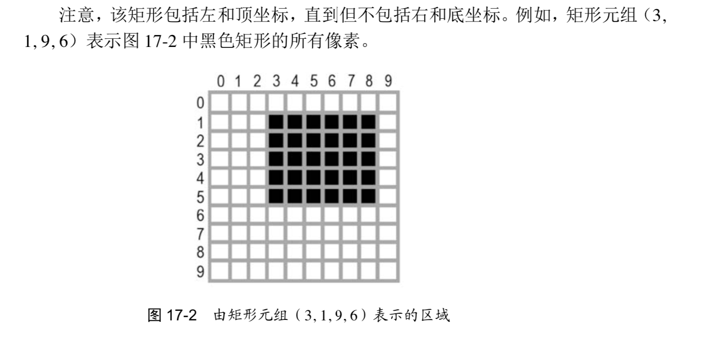

#### 颜色
Pillow 使用html的标准颜色名称(RGBA)：
- White (255,255,255,255)
- Green (0.128.0.255)
- Gray (128,128,128,255)
- Black (0,0,0,255)
- Red (255,0,0,255)
- Blue (0,0,255,255)
- Yellow (255,255,0,255)
- Purple (128,0,128,255)

#### 坐标
W3C坐标系相同，x向右正方向，y向下正方向

#### 矩形参数
许多Pillow函数和方法需要一个矩形元组参数。这意味着Pillow需要一个四个整坐标的元组，
表示图像中的一个矩形区域。四个整数**按顺序**分别是：
- 左：该矩形的最左边的x坐标。
- 顶：该举行的顶边的y坐标。
- 右：该句型的最右面一个像素的x坐标。此整数必须比左边整数大。
- 底，该矩形的底边下面一个像素的y坐标。此整数必须比顶边整数大。

**注意**：该矩形包括左和顶坐标，但是不包括右和底坐标：

