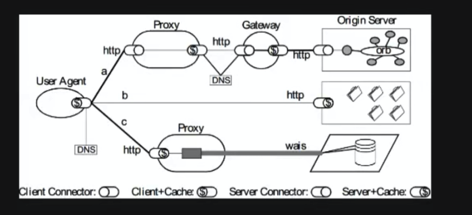

<!--
 * @Author: 27
 * @LastEditors: 27
 * @Date: 2020-04-01 11:18:36
 * @LastEditTime: 2020-04-01 11:29:10
 * @FilePath: /self-article/content/面试积累/计算机网络面试题总结.md
 * @description: type some description
 -->
1. 详细解释一下TCP3次握手机制，为什么需要3次握手？

C/S端用SYN标识发起，另一端回复ACK和SYN，然后发起端再用ACK确认。
因为要拿到对方的序号，才能发送具体内容。
个人这样记忆：三次会让双方都知道彼此可以接收成功消息和发送成功消息。

2. 能否简单介绍下HTTP协议中缓存的处理流程？
考点一：缓存的应用流程是什么？过期缓存，304，200，它们之间的差别是什么，缓存在代理服务器中浏览器中怎么出现的？
考点二：与缓存相关的HTTP头部是什么？

